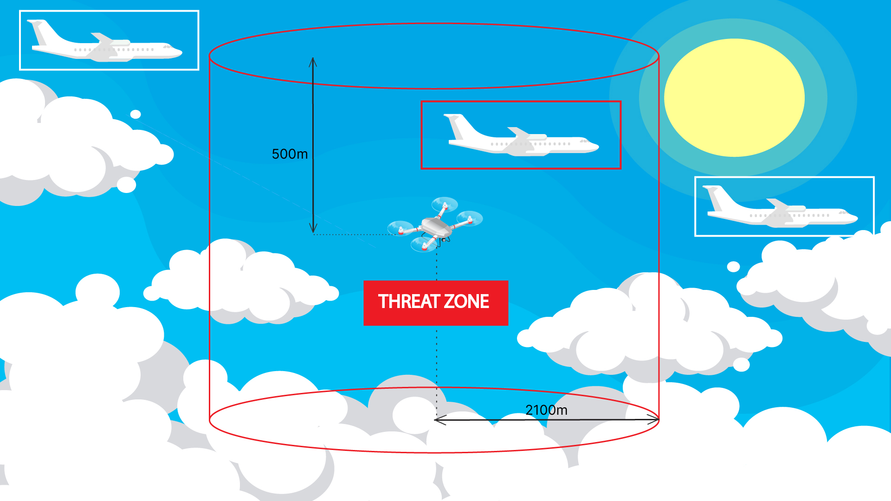

# AirSense

* FlytBase integrates with DJI AirSense, offering real-time alerts and warnings regarding potential conflicts with nearby ADS-B-equipped crewed aircraft.
* DJI AirSense is an alert system that utilizes ADS-B technology to provide drone pilots with enhanced situational awareness.
* It gathers flight data automatically transmitted from nearby aircraft equipped with ADS-B transmitters, analyzes it to detect potential collision risks, and alerts users well in advance.
* This integration helps drone pilots navigate complex airspace more confidently while performing autonomous drone operations using FlytBase.


Airsense is automatically enabled when your drone is online. You can view it on the 'Sensors' page in the Navigation Drawer.


<figure><figcaption>
Sensors Page
</figcaption></figure>

<figure><figcaption>
AirSense 
</figcaption></figure>

* There are two types of threat classification for an incoming aircraft detected by DJI AirSense on the FlytBase dashboard:
  * **Threat:** Aircraft within a 500m height above and below the drone and a radius of 2100m.
  * **No Risk:** Aircraft outside the threat zone.

<figure><figcaption>
DJI AirSense on FlytBase dashboard 
</figcaption></figure>


FlytBase considers aircraft within a 2100m radius of the drone and 500m above and below the drone as a threat.&#x20;


## Expected Behavior&#x20;

### During Pre-flight and In-Flight:&#x20;

* When a threat is detected in the Airspace, the alerts (based on the set classification) for airspace threats are shown continuously on the map once the drone is online.

<figure><figcaption>
Airspace Alerts
</figcaption></figure>


1. DJI AirSense only works with civil aircraft with an ADS-B out device that meets the 1090ES (RTCA DO-260) or UAT (RTCA Do-282) standards. It cannot detect civil aircraft that do not have ADS-B outs or have faulty ones. It also cannot receive ADS-B messages or give warnings if obstacles are blocking the signal between the civil aircraft and the DJI aircraft.
2. DJI AirSense may not be able to receive ADS-B messages or give warnings reliably due to changing conditions and interference. Therefore, it is important to fly carefully and always be aware of your surroundings.
3. DJI AirSense needs the DJI aircraft to have an accurate location to give warnings. It will not work if the DJI aircraft's location is unknown.


* Navigate to 'Sensors', click on 'AirSense' for the specific docking station hardware ID, and access 'Live Traffic' for real-time telemetry information and ADS-B details regarding incoming aircraft.

<figure><figcaption>
Viewing Live Aircraft Traffic 
</figcaption></figure>
