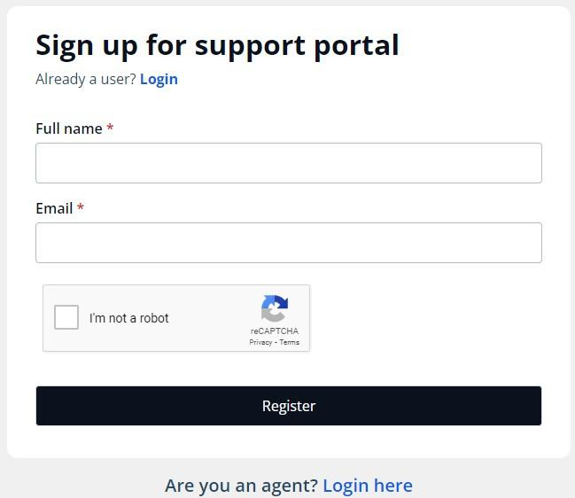
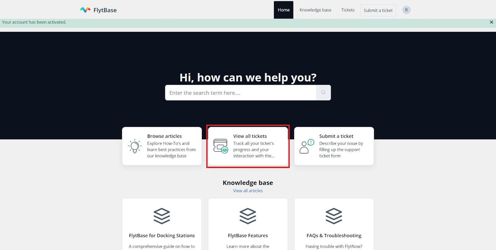

# Contact Technical Support

At FlytBase, we're committed to ensuring a seamless support experience for you. Follow these steps to create your account on our Support Portal.&#x20;

<figure><figcaption>
FlytBase Support Portal Login Page
</figcaption></figure>

## Signup 

* If you are new to FlytBase, visit this [link](https://flytbasehelp.freshdesk.com/support/signup) to create your account.

* Activate your account and create a new password using the link provided to your email ID.

<figure><figcaption>
Create a New Password and Activate your Account 
</figcaption></figure>

## Login

* For existing users, visit this [link](https://flytbasehelp.freshdesk.com/support/login) to login to FlytBase Support Portal.  You can also use Single Sign-On (SSO) options to log in to your FlytBase Support Portal.

<figure><figcaption>
FlytBase Support Portal Login
</figcaption></figure>

## Creating Support Tickets 

Once you're logged in, the process of creating and managing support tickets becomes hassle-free. Here's how:

1. **Submit a Ticket:** After logging in, locate and click on the **Submit a Ticket** button. This action will take you to a comprehensive ticket form.

.jpeg>)

2. **Provide Details:** In the ticket form, fill in essential details such as your Email Address, Subject, and a detailed Description of the issue you're encountering. Attach relevant files such as dashboard snapshots, screen recordings, and Flight Logs during the issue's occurrence.


Include critical information in the issue description, such as the Dock Serial ID, issue timestamp, error code (if applicable), and Organization Name. This gives us a better understanding of the problem and allows us to resolve it more quickly.


3. **Submission:** Once all the required information is provided, hit the **Submit** button. This action will initiate the creation of your ticket within the FlytBase Support Portal.

### Tracking your Ticket’s Progress 

Stay informed about the progress of your tickets by following these steps:

1. **View All Tickets:** To check the status and updates of your tickets, simply click on **View All Tickets** within your FlytBase Support Portal.

<figure><figcaption>
Your Tickets
</figcaption></figure>

2. **Engage with Your Tickets:** Access all your support requests, add comments, add people, and attach relevant files by clicking on the specific ticket.

<figure><figcaption>
View individual ticket
</figcaption></figure>

3. **Status Updates:** Keep an eye on the status of your tickets directly from your personalized tickets page. Ticket Status indicates the following:
   1. **Being Processed:** Ticket Status is Open
   2. **This ticket has been closed:** The ticket is resolved and closed.
   3. **Awaiting your reply:** The ticket is pending
   4. **This ticket has been resolved:** Ticket has been resolved


While you can easily monitor your tickets within the Support Portal, you'll also receive updates on your tickets directly via email.


#### Need Further Assistance?

If you encounter any challenges or are unable to raise a ticket, don't hesitate to reach out to us at [support@flytbase.com](https://app.gitbook.com/o/1WKrYJHWj7ceznXHsf8c/s/TfYUUwVnoRyxqEi8UiRV/). Please provide a comprehensive description of the issue, and feel free to include screenshots or videos of any error messages you've encountered.

