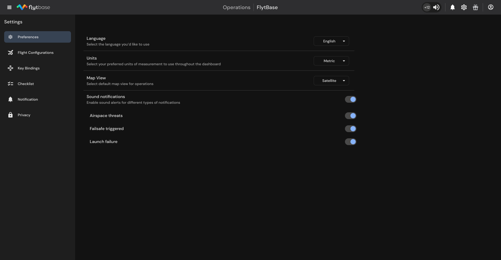

# Alerts and Notifications

To ensure the optimal performance of all devices and the safe planning and execution of missions, FlytBase has enhanced its Alerts and Notifications management on the Dashboard. Users can also enable Sound notifications for important alerts.

## Alerts

Alerts notify users about events that pose a significant danger to autonomous drone operations. You can find these alerts in the **Alerts Center** at the top of the Dashboard. Clicking on it gives you access to the specific alerts issued for that device.

Alerts are triggered by critical events such as when _airspace traffic_ is detected or when a _device failsafe_ is activated. Examples of these events include:

* Loss of Connection between Dock and Drone
* RTK Link Loss
* Low Battery
* Critical Battery
* Detection of a manned glider in the airspace
* ADS-B detection of a nearby passenger aircraft

<figure><figcaption>
Default view of Alerts Center
</figcaption></figure>


Alerts are shown only for the drone card currently selected. To view detailed alerts for a different drone, you must select the appropriate drone card.



Look out for a Warning indicatoron the drone card in the Fleet Management view to see devices that have active alerts.


<figure><figcaption>
Alerts Center with Device Failsafe and Airspace Alerts
</figcaption></figure>

## Notifications

Notifications indicate the final status of important events within the Dashboard. Messages such as those about the start and end of missions, manual drone control, and the transfer of control between members are displayed as pop-up messages at the top of the Dashboard and are listed in the Notifications Center.


To access the Notifications Center, click on the Bell iconin the Top Bar.


<figure><figcaption>
Notifications Center
</figcaption></figure>

To view specific types of notifications, you can use the Success and Failure filter chips in the expanded Notifications Center.


Notifications are generated for all Dashboard-related events across the Organization and are not specific to any one device.


## Sound Notifications

For certain critical events, FlytBase offers the option to enable sound notifications in addition to the messages displayed on the Dashboard. You can toggle sound notifications on or off by navigating to **Settings** -> **Preferences** -> **Sound** **notifications**. Currently, sound notifications are available only for the following events:

* Airspace threat detected
* Failsafe triggered
* Launch failure

<figure><figcaption>
Sound Notifications
</figcaption></figure>


Alerts, Notifications, and Sound Notifications are designed to display information about the status of active devices and actions within an Organization, thereby enabling safe autonomous operations.

