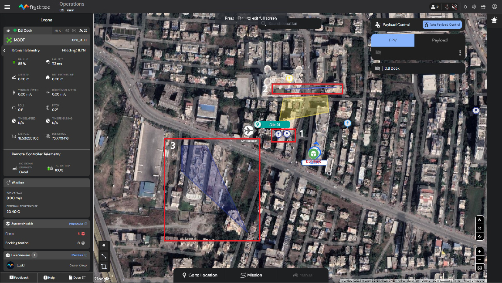

# Annotations

## Types of Annotations

There are 3 different types of annotations that you can have on the FlytBase dashboard:

1. Point Annotations - To mark observational notes at a particular location on the map.
2. Line Annotations - To mark observational notes along a path on the map.
3. Shape Annotation - To mark observational notes for a geographic area on the map.

<figure><figcaption>
Annotations on FlytBase
</figcaption></figure>

## **How To Use Annotations During Your Flight?**

*   Click on the Annotations // icon located on the bottom left corner of the map view, according to whether you want to annotate a point, line, or area.

    <figure><figcaption>
Annotations
</figcaption></figure>

#### Adding a Point Annotation

* To add point annotations, left-click on the desired location on the map.

<figure><figcaption></figcaption></figure>

* A dialogue box will appear, allowing the operator to enter a description, edit latitude and longitude for the location, add altitude relative to the take-off point, assign a colour tag, and save them.

<figure><figcaption>
Adding Annotations
</figcaption></figure>

* You also have the option to either send the drone to the annotated location or to orient the drone towards the specified area.
  * Face here - The drone yaws, and the gimbal pitches as per the defined altitude to face the annotated location on the map. \
    **Note:** The drone must be hovering to respond to the 'Face here' command.\

  * Go to - When you click on 'Go to location', the drone moves to the location and altitude defined for the point annotation. \
    \
    Refer to the following documentation to know more about 'Go to location':


[go-to-location-gtl.md](flight-execution/go-to-location-gtl.md)


#### Adding a Line Annotation

* To add a line annotation, left-click on the desired locations on the map and press 'Enter'.

<figure><figcaption>
Line Annotation
</figcaption></figure>

* A dialogue box will appear, allowing the operator to type in notes, assign a color tag, and save them.

#### Adding a Shape Annotation

* To add a Shape Annotation, left-click on the desired location on the map, drag its vertices or control points on the segments to adjust its shape and location, and then press 'Enter'.

<figure><figcaption>
Polygon Annotation
</figcaption></figure>

* A dialogue box will appear, allowing the operator to type in notes, assign a colour tag, and save them.

## **To review the operator's annotated messages**

* Navigate to **Annotations**section inside the Navigation drawer, to see all the annotations marked on the map.

<figure><figcaption>
Annotations Section
</figcaption></figure>

<figure><figcaption>
Annotations Section
</figcaption></figure>

* Edit, search, or filter between multiple annotations assigned by operators.
* You can even send a drone to the annotated location or make the drone face the particular area in the case of a point annotation.

Annotations are the operator's sticky notes during flight and can serve as a valuable reference for future flights, helping to ensure safe and efficient flight operations.

Please refer to the following documentation to learn more about how to review the flight logs post-flight.


[reviewing-your-flight-logs.md](../post-flight-modules/reviewing-your-flight-logs.md)

