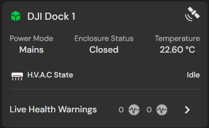
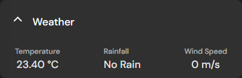
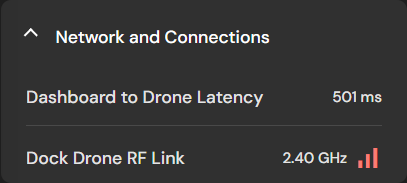
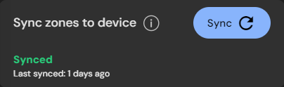

# Fleet Management

Fleet view in FlytBase provides a centralized, intuitive dashboard that offers comprehensive oversight and management of all Devices (drones and docks) within an Organization. It allows operators to quickly access each Device's real-time telemetry, operational status, and health metrics, thus streamlining management and enhancing the safety and efficiency of drone operations.

### Accessing Fleet View

* Click on theicon, and select the **Fleet** tab from the **Navigation Drawer**.&#x20;
* A list of all **Devices** shall be visible in the left panel with each Device represented by a **Device card**.


Fleet Management in FlytBase&#x20;


## Device Card

Upon registration, each **Device (Drone and Dock)** in your fleet appears as a card on the left panel of the Dashboard. These cards facilitate quick access to device information and urgent notifications.&#x20;

<figure><figcaption>
Device Card as seen in Fleet view
</figcaption></figure>


Clicking on a Device card will re-center the map to the geographical location of the corresponding drone.&#x20;


### Device Card: Status Indicators

The status of the Dock and Drone are indicated by the color of their respective icons on the Dashboard:

<table><thead><tr><th width="116" align="center"></th><th align="center">Offline</th><th align="center">Online and Idle</th><th align="center">Online and Armed</th></tr></thead><tbody><tr><td align="center">Dock</td><td align="center"></td><td align="center"></td><td align="center"></td></tr><tr><td align="center">Drone</td><td align="center"></td><td align="center"></td><td align="center"></td></tr></tbody></table>

### Device Card: Quick Telemetry

To give a quick view of the health and telemetry of every Device, following symbols are used in the Device card:

|                            Icon                           |                      Information                      |
| :-------------------------------------------------------: | :---------------------------------------------------: |
|  |   **Device Health** notifications for Drone and Dock  |
|               |        Airspace or Failsafe trigger **Alerts**        |
|               |          **RTK** and **GNSS Satellite count**         |
|               |                   **Battery level**                   |
|               | **Latency** of connection between Drone and Dashboard |
|                |            **Distance** of Drone from Dock            |
|               |             Drone's **Vertical velocity**             |
|               |            Drone's **Horizontal velocity**            |
|               |       Drone's **Altitude** relative to reference      |

Additionally, there are two buttons on the right side of the Device card:

<figure><figcaption>
Detailed View (Red) and New Tab (Yellow) button<strong>s</strong>
</figcaption></figure>

* The .png>) button provides access to a detailed view of telemetry, health, and other relevant device information.
* The .png>) opens a new browser window with the detailed view of the Device card.

## Detailed Device Card

Clicking the .png>) button on the Device Card provides access to the **Detailed Device Card**, which displays the following information:

* Drone Battery and Telemetry
* Dock Status
* Live Health Warnings
* Weather
* Network and Connection Health
* Live Viewers
* Sync Zones

### Drone Battery, Telemetry, and Health notifications

* **Detailed Battery Indicator**: The battery level is displayed as a percentage along with a color-coded bar that provides comprehensive status information. These indicators are essential for monitoring battery usage effectively, ensuring the Drone operates safely throughout the flight.
  * **Green**: This color represents the available battery life required to complete the assigned mission. The **Time Left** indicator uses current flight parameters to estimate how long the Drone can remain airborne.
  * **Yellow**: This color signifies the battery reserve needed to safely execute a **Return to Docking Station (RTDS)** flight, which is the designated response when the **DJI Low Battery Failsafe** is triggered. The yellow section of the battery bar reflects the amount of power necessary to return to the Dock, based on the specific requirements of the assigned mission. RTDS will automatically initiate when the battery level reaches the .png>) mark.&#x20;
  * **Red**: This color indicates the battery reserve allocated for a safe landing from the current altitude. If the battery depletes to this level, the DJI Critical Battery Failsafe is triggered, compelling the Drone to stop all mission-related activities and descend vertically for an immediate landing. The landing process will begin when the battery level hits the .png>) mark.


While it is possible to override the Return to Docking Station (RTDS) mode and resume the mission in emergency situations, we advise against this action. Doing so could potentially compromise both the safety and integrity of the operation.


*   **Status and Satellite Counts**: You can view the number of GNSS and RTK satellites detected by the Drone by hovering your cursor over the  icon.&#x20;

    Additionally, the operational state of the Drone, such as _Standby_ or _Manual Flight_, is clearly displayed as text.
* **Drone Altitude:** Displays the Drone's altitude relative to the chosen reference.
* **Drone Heading:** Shows the direction the Drone is facing, expressed in degrees relative to North, and measured clockwise.
* **Distance from Home:** Indicates the straight-line distance from the Drone to the Dock.
* **Vertical and Horizontal Speeds:** Shows the drone's travel speeds in given directions.

<figure><figcaption>
Drone Telemetry and Status
</figcaption></figure>

### Dock Status

* **Satellite Counts:** The number of GNSS and RTK Satellites detected by the Dock can be seen by hovering the cursor over the icon.
* **Power Mode:** Indicates the type of electricity source used to power the Dock.
* **Enclosure Status**: Shows the current status of the Dock doors.
* **Temperature**: Displays the internal temperature of the Dock.
* **H.V.A.C. Status**: Reflects the operational state of the Dock's H.V.A.C. system, which may be set to idle, heat, or cool the Dock.

<figure><figcaption>
Dock Status
</figcaption></figure>

### Drone and Dock Health Warnings

Live Health Warnings are prominently displayed for the Drone and Dock in the Detailed Device Card. To view warnings specific to a device, click on the .png>) icon.  To access a comprehensive list of all warnings, click on the _**Show all**_ link or navigate to -> **Devices** -> _Select Device_ -> **Diagnostics.** For additional details, please consult the Device Health Management documentation.


[diagnostics.md](../../device-management/device-management/dji-docks/diagnostics.md)


### Weather

Critical weather parameters for drone operations, such as Temperature, Rainfall, and Wind Speed, are displayed in a dedicated section for easy access and monitoring.

<figure><figcaption>
Weather
</figcaption></figure>

### Network and Connections

Key network parameters, including Dashboard-to-Drone Latency (measured in milliseconds), Dock-Drone RF Link frequency, and signal strength, are detailed under the Network and Connections section.

<figure><figcaption></figcaption></figure>

### Live Viewers

The Live Viewers section lists members of the Organization currently monitoring operations for a specific Drone. This feature enhances team collaboration, clarifies roles, and ensures that adequate supervision is maintained at all times.&#x20;

<figure><figcaption>
Live Viewers
</figcaption></figure>

### Sync Zones to Device

To comply with Geofences and No-Fly Zones restrictions, each Device must be synced to these zones before every mission. A sync button is provided to facilitate an easy syncing process.

<figure><figcaption>
Sync Zones button and Sync status
</figcaption></figure>

