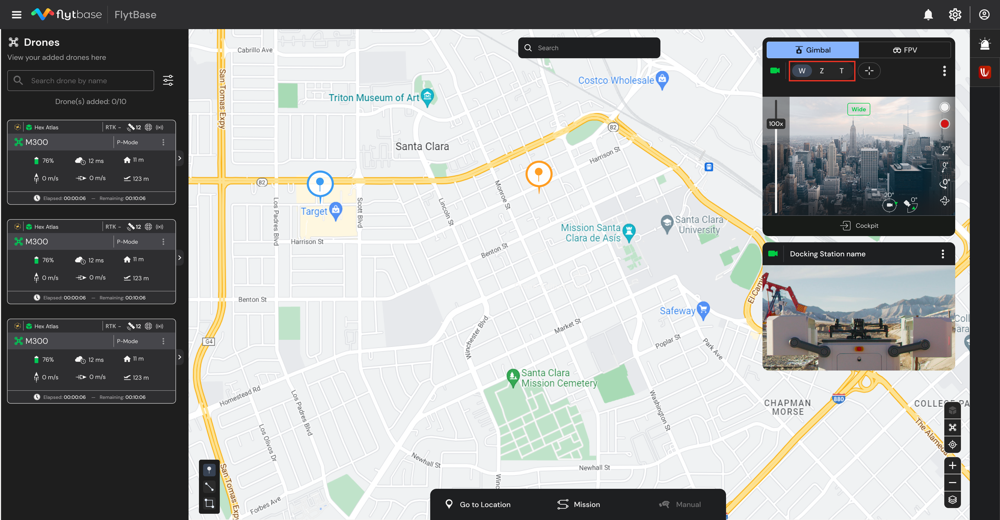

# Payload Controls

## Taking Payload Access Control

To control your Drone's Payload, ensure that you have the necessary access. Refer to the following documentation to learn how to take 'Payload Access Control' from other members within an organization.


[payload-access-control.md](payload-access-control.md)



Before getting started with payload controls; it is important to verify that the drone is online and connected to the FlytBase dashboard. The drone can be turned on from the maintenance tab of the Device Management window.



Payload Controls in FlytBase


## Enabling Live Stream

Once the drone is online you can access the payload controls, you can click on the   (Video Stream button) to enable the live stream.  Similarly, you may click on the  button to disable the video stream.

<figure><figcaption>
Enable/Disable Live Streaming
</figcaption></figure>

## Switching Camera Views&#x20;

You can switch between different camera views available with your drone's payload. When using the drone's payload camera, you may select the desired camera view from the available options, which include:

* Wide-angle&#x20;
* Zoom&#x20;
* Thermal&#x20;

<figure><figcaption>
Switching between cameras
</figcaption></figure>

To switch between the three views, you may left-click on the desired lens type 

* W: Wide-angle
* Z: Zoom
* T: Thermal

### Using the Laser Rangefinder:

M30 Series of drones feature a Laser Rangefinder as part of the payload. This can be used to know the distance and altitude of the subject in the drone's field of view.

To use the Rangefinder, left-click on the  (rangefinder button).

The following information can be obtained using the rangefinder:

1. Distance from the drone (RNG)
2. Altitude relative to the take-off point (RLT)
3. Rangefinder marker on the map

<figure><figcaption>
Laser Rangefinder
</figcaption></figure>

### Switching to Thermal Sensor:

* To switch to the Thermal Sensor, click on the 'T' button .

<figure><figcaption>
Switching to Thermal Sensor
</figcaption></figure>

#### Thermal Palettes:

To switch between various thermal palettes, click on the button.

<figure><figcaption>
IR Palettes
</figcaption></figure>

#### Dual Mode:

Dual Mode allows you to have Thermal and Zoom camera imagery in a single view.

To enable Dual Mode, click on the button.

<figure><figcaption>
Dual Mode
</figcaption></figure>

## Controlling the Gimbal

<figure><figcaption>
Gimbal Controls
</figcaption></figure>

You can take full control of the gimbal with the following options:

1. **Presets:** These presets serve as predefined configurations you can easily switch between, allowing for quick adjustments and achieving desired camera views without manually configuring each parameter individually.
   1. Reset Tilt: Set the tilt angle to -90 degrees.&#x20;
   2. Reset Gimbal Yaw: Reset the gimbal yaw angle to 0 degrees.&#x20;
   3. Reset Entire Gimbal: Reset the entire gimbal to its default position.&#x20;
2. View **Gimbal Pan and Tilt Angles:** Get an overview of the gimbal's current pan and tilt angles for precise positioning.
3. **Double-Click to Move Gimbal:** Double-clicking on the live stream allows you to adjust the gimbal's position and focus around the clicked point, providing a customized perspective for your capturing needs.
4. **Drag to move Gimbal:** Use the mouse to left-click and drag the cursor to move the gimbal in the desired direction. The gimbal movement will follow the cursor movement. Refer to the following image to understand how it functions:

<figure><figcaption>
Drag to move Gimbal
</figcaption></figure>

## Adjusting Zoom Scale

<figure><figcaption>
Zoom Controls
</figcaption></figure>

You can fine-tune the zoom scale by adjusting the dedicated zoom slider. Slide it towards the "+" icon to zoom in and towards the "-" icon to zoom out, allowing for precise control over the desired level of magnification.&#x20;

## Capturing Media Files

<figure><figcaption>
Media Capture Buttons
</figcaption></figure>

Simply click the dedicated buttons to capture data during the flight:&#x20;

1. Capture images
2. Start recording videos&#x20;

## Cockpit View

<figure><figcaption>
Entering Cockpit View
</figcaption></figure>

Click on the cockpit view for an immersive perspective of the drone's surroundings. This view enables operators to remotely control the drone as if they were physically present inside, enhancing their situational awareness and control capabilities during flight operations.

<figure><figcaption>
FlytBase Dashboard: Cockpit View
</figcaption></figure>

## Beacon Light

The Beacon Light is an essential feature for drone visibility and safety, particularly during low-light or night-time operations. FlytBase Dashboard gives the option to turn the beacon light ON or OFF as per operational requirement.

1. Once in Cockpit Mode, to turn the light ON, click on the . It displays the Beacon Toggle.
2. Use the toggle switch to turn the Beacon Light ON or OFF as needed.

<figure><figcaption>
Beacon Toggle
</figcaption></figure>

## Switching Video Feed Quality

<figure><figcaption>
Switching Video Feed Quality
</figcaption></figure>

The video feed quality can be adjusted according to the specific use case requirements, allowing you to optimize the video stream quality based on your preferences and the demands of the situation at hand. You can choose from options such as:&#x20;

1. **Adaptive**
2. **Fluid**
3. **SD (Standard Definition)**
4. **HD (High Definition)**
5. **Super clear**

## Refreshing Video Feed

<figure><figcaption>
Video Stream Refresh Button
</figcaption></figure>

Using the Video Stream Refresh Button, you can manually update or refresh the live video stream displayed on the dashboard. This feature comes in handy when the video feed is unavailable or stuck due to network issues, ensuring that you can maintain a continuous and uninterrupted visual feed during your remote drone operations.

