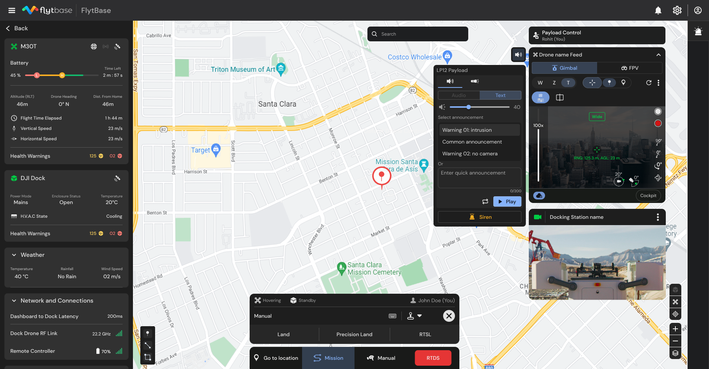

# Speaker and Spotlight

With FlytBase, you can easily manage speaker and spotlight payloads on your drone. Here's what you can do:

* **Save and Broadcast Announcements:** Store messages, or draft a quick message, and use the text-to-speech feature to make announcements.
* **Adjust Spotlight Settings:** Change the brightness and switch between spotlight or strobe modes.
* **Activate Siren:** Set off a siren sound and strobe light to indicate a critical situation or to deter intruders.

Such systems enhance your drone's capabilities for perimeter security or search and rescue applications.


Currently, the speaker and spotlight payloads supported include:

* For **DJI Dock 1/M30 Series** drones (M30, M30T): **CZI LP12**
* For **DJI Dock 2/M3D Series** drones (M3D, M3TD):&#x20;
  * **JZ M3D Quick Search Kit**
  * **Cytop MLV3D**
  * **CZI MP20**

Reach out to **support@flytbase.com** to know more.


## Speaker

### Adding Announcements

To add announcements to a payload, follow these steps:

* **Attaching the Payload**: Attach the payload to the drone, and power on the drone.
* **Navigating to the Payload Tab**: On the FlytBase Dashboard, go to the **Device Management** section, and select the **Payload** tab.

<figure><figcaption>
Payload Tab for the selected device
</figcaption></figure>

The Payload tab allows you to perform the following operations:

* **Add Audio for playback:** You can add audio files that can be played by any drone using its payload.

<mark style="color:yellow;">\[ modify this section so that an image for this feature is added ] \[You can do two things in payload section - add audio files, or add text announcements ]</mark>

* **Creating an Announcement**: Click on the **Add** button. This action will bring up a dialog box where you can configure your announcement. In the dialog box, enter a name for your announcement and type your announcement text.&#x20;


Announcement text cannot exceed 200 characters.


<figure><figcaption>
Adding a new announcement
</figcaption></figure>

* **Saving the Announcement**: After entering your information, click **Save** to finalize the announcement.


You can create up to twenty announcements for each payload.


<figure><figcaption>
Saved announcements
</figcaption></figure>

### Operating the Speaker

To use the Payload, navigate to the **Fleet view** and select the **Payload** icon adjacent to the drone video feed widget.

The payload widget would expand, allowing access to speaker and spotlight tabs.

<figure><figcaption>
Expanded Payload widget
</figcaption></figure>

#### Play a saved Announcement

* In the expanded Payload widget, click on the **Speaker** tab.
* Choose the desired announcement from the list of saved announcements and click **Play**.
* To keep repeating the selected message, click on the  icon. The message will be repeated as long as the  icon is not pressed again or message playback is stopped from the Play/Stop button.

<figure><figcaption>
Select Announcement 
</figcaption></figure>

#### Quick Announcement

For making an urgent custom announcement:

* Type your message (up to 200 characters) in the **Quick Announcement** box.
* Click **Play** to broadcast your message immediately.

<figure><figcaption>
Quick Announcement
</figcaption></figure>


Quick announcements are not stored in the list of Saved Announcements.


#### Speaker Volume Settings

Adjusting the speaker volume:

* Use the volume bar to increase or decrease the volume according to your preference.
* The volume can be adjusted within a range from 0 to 40.

## Spotlight Settings

If the payload includes a controllable spotlight (such as in LP12), it can be operated through the Payload widget.

**Activating the Spotlight**

To control the spotlight:

* Click on the **Spotlight**  in the **Payload** widget.&#x20;
* Use the **toggle button** to turn the spotlight on or off.

**Adjusting Brightness**

Adjust the brightness of the spotlight:

* Move the **brightness slider** to the right to increase brightness or to the left to decrease it.

**Spotlight Modes**

The spotlight offers two modes:

* **Static Mode**: The spotlight remains continuously on at a consistent brightness.
* **Strobe Mode**: The spotlight alternates between on and off, creating a pulsating effect.

<figure><figcaption>
Spotlight Controls
</figcaption></figure>

## Siren

If the payload is equipped with a Siren feature, you can activate it through the **Payload** widget on the FlytBase Dashboard.&#x20;

**How to Activate the Siren**

* Navigate to the **Payload** widget.
* Locate the **Siren** button at the bottom of the widget; this button is common for both the speaker and the spotlight.
* Click the **Siren** button to activate the siren, which switches on the spotlight in strobe mode and plays the default siren sound.

<figure><figcaption>
Siren button
</figcaption></figure>
