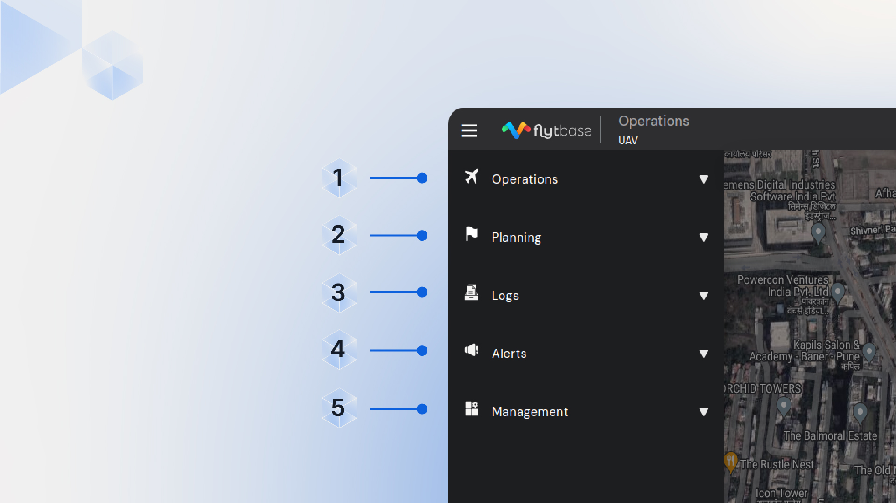

# Navigating Your FlytBase Platform

## Navigation Drawer

The navigation drawer provides you with access to all the major flight modules necessary for autonomous drone flights as an operator.

<figure><figcaption>
Navigation Drawer Overview
</figcaption></figure>

<figure><figcaption>
Using the Navigation Drawer
</figcaption></figure>

#### You can access the following using the Navigation drawer:

1. **Operations**: A Control Center to manage, control, and view live streams of your real-time fleet operations.
   * **Drones**.png>): View crucial drone telemetry data, [<mark style="color:blue;">execute missions</mark>](../in-flight-modules/flight-execution/)<mark style="color:blue;">,</mark> and [<mark style="color:blue;">launch the drone</mark> ](../in-flight-modules/how-to-manage-your-flight-operations/fleet-management.md)to a particular location.
2. **Planning**.png>): Create and schedule missions.
   * **Missions**.png>): Plan and create missions using a [<mark style="color:blue;">mission planner</mark>](../pre-flight-modules/planning/mission-planning/).
   * **Schedule**.png>): Create a [<mark style="color:blue;">flight schedule</mark>](../pre-flight-modules/planning/mission-scheduler.md) to launch missions at a particular time and date or repeat it daily.&#x20;
3. **Logs**.png>): An organized repository of all your post-flight reports & media.
   * **Flight Logs**.png>): Access [<mark style="color:blue;">flight logs</mark>](../post-flight-modules/reviewing-your-flight-logs.md) of all the previous flights.
   * **Gallery**: View and download images or videos stored in your [<mark style="color:blue;">private cloud storage</mark>](../post-flight-modules/gallery.md).png>).
4. **Alerts**.png>): Manage all your alarms.
   * **Alarms**.png>): View, manage, and respond to third-party alarms integrated with FlytBase.
5. **Management**: Manage and maintain all your devices on FlytBase.
   * **Devices**: Add new [<mark style="color:blue;">devices</mark>](../device-management/device-management/dji-docks/device-maintenance.md), set up and manage them, access devices remotely, perform maintenance tasks, and monitor critical [<mark style="color:blue;">device diagnostics</mark>](../device-management/device-management/dji-docks/diagnostics.md) for any abnormalities.
   * **Sensors**: Add and Manage third-party detect and avoid sensors like Casia-G.

## Top bar&#x20;

The top bar displays information and actions at the top of the FlytBase dashboard.

<figure><figcaption>
Top Bar Overview
</figcaption></figure>

<figure><figcaption>
Using the Top Bar
</figcaption></figure>

#### From the Top bar, you can access:

1. **Notification center**: Contains a list of pop-up messages that appear on the dashboard during a session.
2. **Settings**: Access and configure [settings](../pre-flight-modules/platform-settings/) for drones and docking stations.
3. **What's New**: Learn about useful new features, improvements, and fixes in FlytBase.
4. **Account info**: Access [account](broken-reference) information, provide [role-based action controls](../getting-started-with-your-flytbase-account/roles-and-permissions.md) and seamlessly navigate among all your Organization Operation dashboards.

## App Integrations

A simple new way to access all your third-party integrations and widgets.

<figure><figcaption>
App Integrations
</figcaption></figure>

Now that you've got a glimpse of the FlytBase dashboard, let's move to Device Management, where you'll learn how to [add, set up](../device-management/add-and-setup-your-device/register-your-dji-dock-1-and-2.md), and [manage your devices](../device-management/device-management/dji-docks/device-maintenance.md) on the dashboard.
