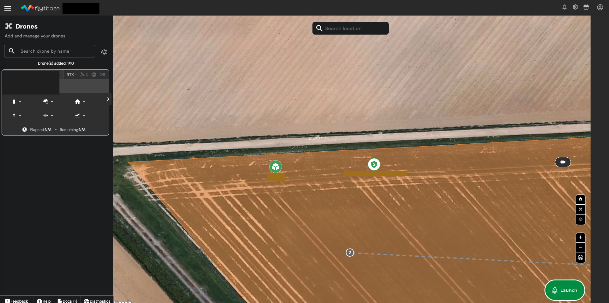

# Alternate Landing Location

## Setting the Alternate Landing Location

Ensure that the alternate landing location and alternate landing location altitude have been set during the initial dock configuration on the DJI RC Plus.&#x20;

* During the initial setup of the dock, a page will be displayed in the DJI Pilot 2 App, allowing you to configure an alternate location. Follow these steps:&#x20;
  * Ensure the drone is powered ON and place it at the alternate landing site you would want to choose, ensuring it is free from obstacles.&#x20;
  * In the DJI Pilot 2 app, tap on Set Alternate Landing Site to establish the chosen location as the alternate landing site.
  * Adjust the Alternate Route Altitude, taking care to verify that there are no obstacles along the flight path from the dock to the alternate landing site to prevent any potential collisions. Click on "Set Height" to save the Alternate Landing Location Altitude.

<figure><figcaption>
Setting Alternate Landing Site on DJI Pilot 2 App
</figcaption></figure>

<figure><figcaption>
Setting Alternating Route Altitude on DJI Pilot 2 App
</figcaption></figure>

## Viewing the Docking Station Location and Alternate Landing Location on FlytBase

To view the Docking Station Location and Alternate Landing Location on the FlytBase dashboard, follow these steps:

* Register the Dock: Make sure that you have successfully registered the DJI Dock with FlytBase. This step ensures that the system recognizes the dock's location using its global positioning.&#x20;
* Once both the dock's location and the alternate landing location have been registered and the dock is online, you will be able to locate the locations displayed on the map within the FlytBase dashboard. This visualization provides you with a clear view of the locations, aiding in monitoring and ensuring safe flight operations.

<figure><figcaption>
Docking Station and it's Alternate Landing Location on FlytBase
</figcaption></figure>

## Behavior of the drone while initiating the Alternate Landing Location Maneuver

<figure><figcaption>
Expected Behavior; as indicated by DJI User Manual
</figcaption></figure>

The Alternate Landing Location feature provides an added layer of safety for your DJI Dock and M30 drone. By setting this feature up correctly, you can ensure secure landings even in challenging situations.

Head over to the [Platform Settings](../platform-settings/) to learn more about the essential settings you need to configure for safe and efficient flight operations.&#x20;

