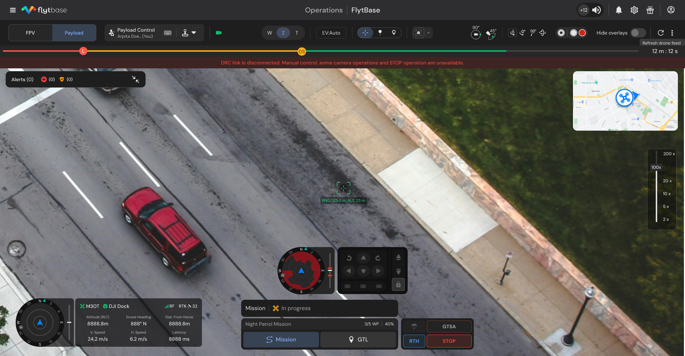
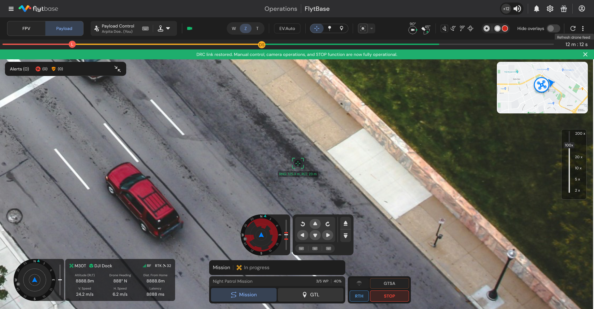

# DRC Visibility

## **Introduction**

Manual drone operations play a crucial role in real-time flight scenarios. To ensure pilots are fully aware of connectivity to backend services that affects manual controls, FlytBase now introduces **DRC Visibility**: a system that alerts operators when the **Drone Remote Control (DRC) link** disrupted. DRC refers to backend services on FlytBase server which are responsible for relaying manual control signals between Dock-Drone and Operator.

This addition boosts transparency and operational clarity, for issues affecting manual control of the drone and the payload.

## **Key Features** 

* **Live DRC Connection Alerts:** Users will now see a warning banner— `"DRC link is disconnected. Manual Control, some camera operations and STOP operation is unavailable"`—if the connection to the DRC services drops during a mission or manual flight.
* **Mission execution remains unaffected:** Mission execution (e.g., Path, Grid or Go To Location flights) continues uninterrupted, ensuring missions are not compromised by DRC issues. This warning system strictly applies to manual drone and payload operations.
* **Realtime Recovery:** Once the DRC connection is re-established, the warning disappears automatically and full manual control—for drone and payload operations—is restored.
* **Regional Server Support:** For FlytBase users experiencing DRC reliability issues while operating using the default server, **new regional servers handling the DRC service** have been deployed. These offer:
  * **Lower latency** during manual flights
  * **Improved stability** in manual control
  * **Reduced disconnection rates**

## Managing DRC Connection Visibility 

* Navigate to the **Cockpit View** or **Fleet View during your** flights.
* The **DRC Link Loss Visibility Banner** will automatically appear on the top of the window when DRC connectivity issues arise. This can happen during:
  * Manual drone flights
  * Path and Grid Missions
  * Go-To Location (GTL) flights
  * Manual payload control operations

<figure><figcaption>
<strong>DRC Link Disconnection Visibility Banner</strong>
</figcaption></figure>

* Once the DRC connection is re-established, the warning disappears automatically and full manual control—for drone and payload operations—is restored.

<figure><figcaption>
<strong>DRC Link Resolved Visibility Banner</strong>
</figcaption></figure>

* No additional configuration required—this is available by default for all FlytBase users.

## **Recommended Actions for Users with Frequent DRC Link Disconnections:** 

If you frequently encounter the DRC link disconnection warning:

* **Ensure that the drone, dock, and operator station** have a stable, high-bandwidth internet connection—preferably over Ethernet or high-speed LTE/5G.
* **Run a network test** at your site to verify:
  * **Latency**
  * **Packet loss**
  * **Upload/download consistency**
* If issues **persist**, please perform the network test as highlighted [here](https://drive.google.com/file/d/1_eIrtVBKSQ51qMWm9wNRrylYs_L2Kwws/view?usp=sharing). and reach out to support@flytbase.com with your connection test results.

## **Benefits** 

* **Enhanced Pilot Awareness:** Operators are clearly informed about the network issues during the DRC disconnection, reducing confusion in the field.
* **Reliable Remote Control Globally:** Regional servers ensure smoother manual control across geographies—especially valuable in low-connectivity or high-latency environments.

\
