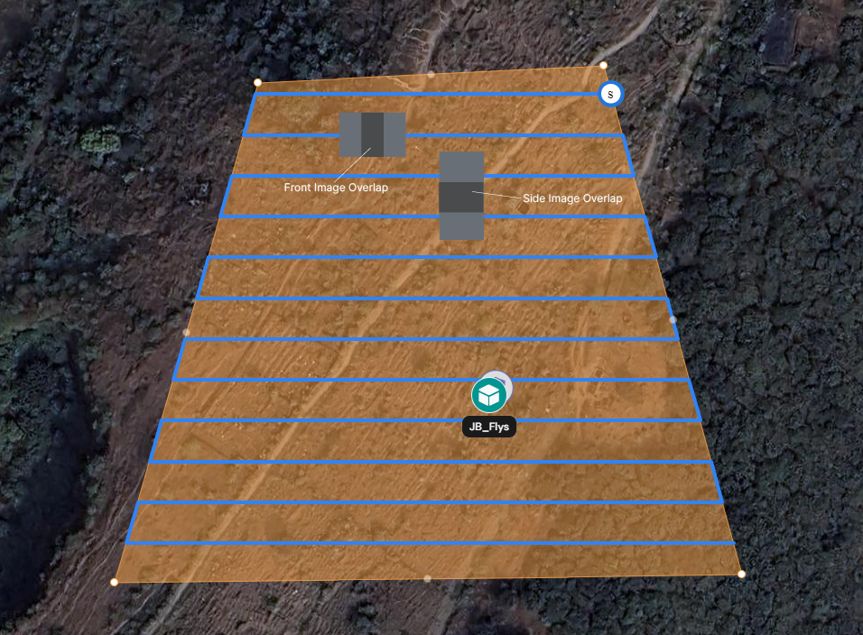
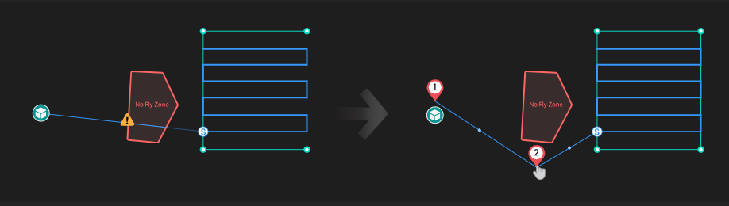

# Grid Mission

A Grid Mission consists of a series of straight-line flight paths that run parallel to each other. These missions are commonly used for imaging and surveying applications. FlytBase enables the creation and modification of grid missions by allowing users to control parameters such as Ground Sampling Distance (GSD), Front Overlap, Side Overlap, and more.

## Plan a Grid Mission

* Go to the **Navigation Drawer** and select the **Missions** tab under the **Planning** section.

<figure><figcaption>
Missions tab in Navigation Drawer
</figcaption></figure>

* Click onicon to add a mission.

<figure><figcaption>
Adding a Mission
</figcaption></figure>

* Under the **Grid** **Mission** section, select **Create Mission**.

<figure><figcaption>
Creating a Grid Mission
</figcaption></figure>

* Provide a name to the new mission.

<figure><figcaption>
Adding a Mission Name
</figcaption></figure>

* Assign a **Site** for the particular mission.


You can assign multiple **Sites** for a mission.


<figure><figcaption>
Assigning a Site for a mission
</figcaption></figure>

To learn more about **Sites**, refer to the following documentation:


[site-management.md](../../../getting-started-with-your-flytbase-account/site-management.md)


* Add **Tags** to your mission to improve mission management.

<figure><figcaption>
Adding Tags to your mission
</figcaption></figure>

To learn more about **Mission Management**, refer to the following documentation:


[mission-management.md](../mission-management.md)


* Simply left-click on the map to create a grid. Adjust the vertices of the polygon according to your preferences. The _**S**_ annotated on the grid represents the Grid Start Point.

<figure><figcaption>
Creating a Grid
</figcaption></figure>

* After creating the grid, mission details like the **Total Area** covered, **Estimated Time** to complete, and **Estimated Number of Images** to be taken can be found below **Tags**. This information helps in customizing the mission settings according to user preferences.

<figure><figcaption>
Grid Mission Overview
</figcaption></figure>

## Configuring Grid Mission Parameters

### 1. Select Payload

Select the drone payload to be used during the mission. You can select either **M30 Payload** or **M30T Payload** based on the available hardware.

<figure><figcaption>
Selecting the drone payload
</figcaption></figure>

### 2. Select Lens (Imaging Sensor)

Based on the selected payload, you can now select the imaging sensors that would be used while executing the mission.&#x20;

* In the case of **M30 Payload**, you can use the **Wide**-Angle lens.

<figure><figcaption>
Selecting Lens for M30 Payload
</figcaption></figure>

* In the case of a **M30T Payload**, you have the option to either select the **Wide**-Angle imaging sensor, **IR Mode** imaging sensor, or both. When both sensors are selected, the GSD settings for them are displayed below the Route Altitude tab.

<figure><figcaption>
Selecting Lens for M30T Payload
</figcaption></figure>

### 3. Take-off Altitude

The drone achieves a set Take-off Altitude and then proceeds to start the Grid Mission. Following are the different modes that you can select from:

<figure><figcaption>
Take-off Altitude settings
</figcaption></figure>

* **Default Take-off Altitude**\
  The drone achieves the altitude of Grid Start Point (i.e., Route Altitude), and then proceeds towards it.

<figure><figcaption>
Default Take-off Altitude
</figcaption></figure>


You can set the **Take-off Altitude** for a particular device by navigating to **Devices** -> _Select Device_ -> **Settings** -> **Drone Control**. The take-off altitude you set during mission planning will take precedence over the default values set in **Settings.**


* **Safe Take-off Altitude**\
  The drone achieves the 'Safe Take-off Altitude’ and then _diagonally_ proceeds to the Grid Start Point.

<figure><figcaption>
Safe Take-off Altitude
</figcaption></figure>

<figure><figcaption>
Configuring Safe Take-off Altitude
</figcaption></figure>

### 4. Altitude Reference, Route Altitude, and GSD

&#x20;There are three types of Altitude References that you can select from:

<figure><figcaption>
Route Altitude modes
</figcaption></figure>

* **Relative Take-off Point (RLT)** \
  Relative altitude is measured from the take-off point. Additional care should be taken when planning close to ground in uneven terrain. Route/waypoint altitude needs to be adjusted based on terrain height.

<figure><figcaption>
Relative Take-off Point
</figcaption></figure>

* **Above Sea Level (ASL)**\
  Absolute altitude of the drone as represented in the [EGM](https://en.wikipedia.org/wiki/Earth_Gravitational_Model) model. Use ASL for missions that require global altitude measurements, since the reference is set to the sea level.

<figure><figcaption>
Above Sea Level
</figcaption></figure>

* **Above Ground Level (AGL)**\
  Altitude set with reference to the ground level. Reliable ground elevation data is essential for using this option safely. This mode is best suited to follow the terrain automatically to maintain a specific elevation relative to the ground at any point in the mission.

<figure><figcaption>
Above Ground Level
</figcaption></figure>


Currently, only RLT Altitude configuration mode is active on the Dashboard.


* After selecting the Altitude Reference, you can set the following mission parameters:
  * **Route Altitude:** The altitude at which the drone will execute the Grid mission.
  * **GSD (Ground Sample Distance):**  _GSD refers to the dimensions of a single pixel in an image (cm/px), as measured on the ground_. It is calculated based on the drone's sensor properties and the focal length, as well as the altitude at which the drone is executing the mission.&#x20;


The GSD is calculated based on the Route Altitude and vice versa.



You can also set the Route Altitude by accessing **Settings** -> **Flight Configuration**. The altitude set during mission planning will take precedence over the default value specified for flight altitude in Flight Configuration.



**Ground Sampling Distance (GSD)** helps in the efficient planning of grid missions. It enables the calculation of the optimal altitude and speed at which the drone should fly to achieve the desired image resolution, ensuring coverage of the target area without unnecessary data overlaps or gaps. For precise measurements, detailed site inspections, and accurate volumetric calculations, a lower GSD is preferable as it captures more detail.


### 5. Advanced Mission Settings

You can configure the following mission parameters within **Advanced Settings**: &#x20;

<figure><figcaption>
Advanced Mission Settings
</figcaption></figure>

#### Grid Route Speed

Set the speed at which the drone would fly over the grid flight path.&#x20;

<figure><figcaption>
Configuring the Grid Route Speed
</figcaption></figure>


The suggested Grid Route Speed is smartly calculated based on the selected Route Altitude and GSD.



Changing the recommended Route Speed may impact the amount of images captured during the mission.


#### Grid Angle

The grid angle can be adjusted to change the orientation of the grid.&#x20;

<figure><figcaption>
Configuring the Grid Angle
</figcaption></figure>

#### Route waypoint type

<figure><figcaption></figcaption></figure>

You can configure the drone’s flight path using the following waypoint options:

* **Linear path**\
  Drone takes a straight path and stops at each waypoint for precise tasks like inspection or image capture.
* **Transits waypoint**\
  Drone flies through each waypoint along a curved path without stopping, ideal for smooth and fast missions
* **Curved route, stops at waypoint**\
  Drone follows a curved path and stops at each waypoint to enable smooth transitions with accurate data capture
* **Curved route, drone continues**\
  Drone moves at a constant speed through curved paths without stopping, perfect for continuous or cinematic flights.
* **Controlled radius**\
  Drone turns at waypoints using a set turning radius for smooth, consistent curves useful in mapping or surveying. The waypoint radius would need to specified here.&#x20;

<figure><figcaption>
 Controller Radius Settings
</figcaption></figure>

#### Capture Angle

Following parameters can be set to orient the camera in the desired direction:

* **Gimbal Pitch:** The camera will point up or down depending on the value of this parameter.
* **Drone Yaw:** Set the yaw angle at which the drone would conduct the mission. The yaw angle can be configured relative to the **Flight Path** or **North** depending on the requirements.


The drone's yaw is locked at the set angle relative to the reference axis (**Flight Path** or **North**) and will not change as the mission progresses.


<figure><figcaption>
Setting the Camera Angle
</figcaption></figure>

#### Image Overlap

Image Overlap parameters affect the percentage of region photographed that would be common between two consecutive images taken along the flight path, or two images taken over adjacent flight paths. Changes in these parameters affect the Route Speed and Grid spacing. Moreover, changes in overlap parameters can affect the time taken to process the images and the quality of output obtained after processing.

<figure><figcaption>
Image Overlap settings
</figcaption></figure>

* **Front Overlap:** Front Overlap refers to the overlap between two consecutive images taken along the flight path of the drone. It is the percentage of overlap between the front end of one image and the back end of the preceding image. The primary purpose of front overlap is to ensure that there is sufficient coverage and redundancy in the captured images for creating accurate and seamless maps or 3D models. High front overlap is essential for photogrammetry, where multiple viewpoints of the same area are required to stitch the images together accurately.
* **Side Overlap:** Side Overlap refers to the overlap between images captured across adjacent flight paths. It is the percentage of overlap between the side of one image and the side of another image from a parallel flight path. Similar to front overlap, side overlap ensures comprehensive coverage of the area being mapped or modeled. It helps in accurately aligning and stitching together images from different flight lines, crucial for creating uniform, high-quality maps or 3D models without gaps.

<figure><figcaption>
Illustration of Front and Side Overlap of images in Grid Mission
</figcaption></figure>

### 6. Approach Settings

For increased safety and efficiency, users can configure the approach path and speed leading to the starting point of a grid mission. This feature provides greater flexibility in designing and aligning the grid mission to meet specific requirements. The following approach parameters can be controlled:&#x20;

* **Approach Speed**: Set the drone's speed for approaching the mission's starting point.
* **Custom Approach Route**: Use the toggle button to enable a custom approach route. If not enabled, the drone will fly directly from its dock to the grid mission's start point in a straight line.

<figure><figcaption>
Custom Approach Route for Grid Mission
</figcaption></figure>

* **Setting an Approach Route**:
  1. Click on the map to mark the starting point of the approach path.
  2. Drag and drop waypoints (midpoints of straight line segments) between this start point and the grid mission's start point to create the desired approach path.
* **Managing Waypoints**:
  1. Waypoints are listed for easy navigation; use the left and right arrows to view all waypoints.
  2. To remove a waypoint, click on the icon.

<figure><figcaption>
Drone Approach Settings (in Red), and Waypoint toggles (in Green)
</figcaption></figure>

### 7.  RF Link Loss Condition

This setting defines the drone's behavior in the event of RF link loss. Users can configure it to either continue the mission or initiate a Return-to-Home (RTH) procedure.

<figure><figcaption>
RF Link Loss Condition
</figcaption></figure>

### 8. Positioning Accuracy&#x20;

&#x20; Different positioning accuracy options can be configured here:

* GNSS : Relies solely on satellite positioning to guide the drone. Suitable for operations where centimeter‑level precision is not critical. The accuracy range is as following:
  * Horizontal: ± 1.5 m
  * Vertical: ± 0.5 m
* RTK : Switches to Real‑Time Kinematic corrections for ultra‑precise navigation Recommended for applications requiring ultra‑precise station‑keeping such as mapping using grid missions. The accuracy range is as following:
  * Horizontal: ± 0.1 m
  * Vertical: ± 0.1 m

### 9. Finish Action

Choose the finish action for the drone when it completes the grid mission. Here are the different finish actions that you can configure:

* **Return to Docking Station (RTDS)** - The drone goes back to the docking station.&#x20;
* **Exit Mission and Hover** - The drone hovers at the end point of the grid.&#x20;
* **Go to First Waypoint and Hover** - The drone moves to the start point of the grid and hovers there.

<figure><figcaption>
Finish Action
</figcaption></figure>

Once all settings have been done, click on **Save** to save the mission. This mission will then appear in the **Missions** tab on the FlytBase dashboard.

<figure><figcaption>
Save Mission
</figcaption></figure>

<figure><figcaption>
Missions tab
</figcaption></figure>

To know more on how to **import a mission as a KML file**, refer to the following [documentation](importing-a-mission-using-kml-file.md).
