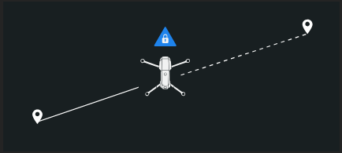
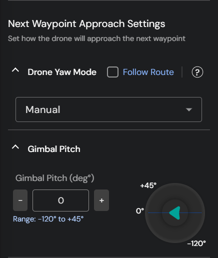

# Path Mission

A **Path Mission** refers to a predefined flight operation where the drone follows a specific route mapped out using **waypoints**. The drone can perform certain actions at waypoints, and adjust speed and altitude while traveling between them. This mission type is essential for tasks that require precise movement along a designated path, offering control over the drone's flight pattern.&#x20;

## Path Mission Planning&#x20;

* Inside the **Navigation Drawer,** select the **Missions** tab under the **Planning** section.

<figure><figcaption>
Navigating to <strong>Mission Planning</strong> section
</figcaption></figure>

* Click onicon to add mission.

<figure><figcaption>
Adding a <strong>Mission</strong>
</figcaption></figure>

* An operator can plan a **Path Mission** using two methods:
  1. Create a mission
  2. [Import a mission using a KML file](importing-a-mission-using-kml-file.md)

<figure><figcaption>
Path Mission
</figcaption></figure>

## Creating a new Path Mission

* Under the **Path Mission** section, select **+ Create mission** ta&#x62;**.**

<figure><figcaption>
Creating a Path Mission
</figcaption></figure>

* Provide a name for the new mission.

<figure><figcaption>
Adding a mission name
</figcaption></figure>

* Select the **Site** you want the mission to be a part of. Only members of the site selected will have access to the mission for drone operations. Refer to the following documentation to know more:


[site-management.md](../../../getting-started-with-your-flytbase-account/site-management.md)


<figure><figcaption>
Adding a 'Site' to a particular mission
</figcaption></figure>


You can add a mission to multiple Sites.


* Assign **Tags** to your mission for better mission management.

<figure><figcaption>
Assigning 'Tags' to your Mission
</figcaption></figure>

To learn about mission management, please refer to the following documentation.


[mission-management.md](../mission-management.md)


* **Left-click** on the map to add a waypoint for the mission.

<figure><figcaption>
Adding Waypoints
</figcaption></figure>


Recenter the map to the location of the mission using the Recenter iconand delete the mission using the delete icon.&#x20;



Operators can efficiently plan complex path missions with multiple waypoints using [Smart Selection Tools](path-mission.md#smart-selection-mode).


## Configuring Mission Route and Waypoint Parameters



You can configure the following Path Mission Route parameters on FlytBase:

#### 1. Route Altitude

This is the default altitude at which the mission will be conducted. There are three types of route altitude references that you can select:

<figure><figcaption>
Route Altitude modes
</figcaption></figure>

* **Relative Take-off Point (RTL)** \
  Altitude is set relative to the **Reference Take-off Point** as marked on the map while planning a mission. Additional care should be taken when planning close to ground in uneven terrain. Route/waypoint altitude needs to be adjusted based on terrain height.

<figure><figcaption>
Relative Take-off Point
</figcaption></figure>

* **Above Sea Level (ASL)**\
  Absolute altitude of the drone as represented in the [EGM](https://en.wikipedia.org/wiki/Earth_Gravitational_Model) model. Use ASL for missions that require global altitude measurements, since the reference is set to the sea level.

<figure><figcaption>
Above Sea Level
</figcaption></figure>

* **Above Ground Level (AGL)**\
  Altitude is set relative to the ground level. Reliable ground elevation data is essential for using this option safely. This mode is best suited to follow the terrain automatically to maintain a specific elevation above ground at any point in the mission.

<figure><figcaption>
Above Ground Level
</figcaption></figure>


Currently, only the RTL altitude can be set on the dashboard.



You can also set the **Route Altitude/Flight Altitude** by going to [**Settings**](../../../device-management/device-management/dji-docks/device-settings/drone-control.md) **-> Flight Configuration -> Flight Altitude**. The Route altitude set during mission planning will take precedence over the value specified for Flight altitude in the Settings.


#### 2. Take-off Altitude

Take-off altitude settings allow you to specify a height for the drone to reach during take-off, ensuring it ascends safely before proceeding with its mission. Once the designated take-off altitude is achieved, the drone will move diagonally towards the first waypoint. There are two methods to set the take-off altitude:

<figure><figcaption>
Take-off Altitude modes
</figcaption></figure>


You can set a device-specific **Take-off Altitude / Safe Altitude** by going to [**Devices**](broken-reference) **-> Device Settings -> Drone Safety**. The safe take-off altitude set during mission planning will take precedence over the one set in **Device Settings**.


* **Default Take-off  Altitude**\
  The drone will achieve the first waypoint's altitude and then approach the first waypoint.

<figure><figcaption>
Default Take-off Altitude
</figcaption></figure>

* **Safe Take-off Altitude**\
  The drone will achieve the **Safe Take-off altitude** and then _diagonally_ proceed to the first waypoint.

<figure><figcaption>
Safe Take-off Altitude
</figcaption></figure>

<figure><figcaption>
Configuring Safe Take-off Altitude
</figcaption></figure>

#### 3. Route Speed

The speed set here will be the default speed at which the mission will be executed. However, if a different speed is required between two or more waypoints, it can be configured in waypoint-specific settings.


The option to select the **follow route** speed comes while specifying waypoints. Refer to the following [documentation](path-mission.md#waypoints) to know more.


<figure><figcaption>
Route Speed
</figcaption></figure>

#### 4. Route Waypoint Type

This allows you to set how the drone will approach each waypoint, and consequently what the path would look like. There are five options to choose from:

<figure><figcaption>
Route Waypoint Type
</figcaption></figure>

* **Linear Route**\
  The drone takes a straight path and stops at each waypoint.

<figure><figcaption>
Linear Path
</figcaption></figure>

* **Transit before Waypoint**\
  The drone takes a curved path before reaching each waypoint and flies through it.

<figure><figcaption>
Transit before waypoint
</figcaption></figure>

* **Curved path, stops at waypoint**\
  The drone takes a curved path and stops at each waypoint.

<figure><figcaption>
Curved path, stops at waypoint
</figcaption></figure>

* **Curved path, moves smoothly**\
  The drone follows a curved path and moves steadily at a constant speed without stopping at any waypoint.

<figure><figcaption>
Curved path, moves smoothly
</figcaption></figure>

* **Controlled radius** \
  The drone will turn before the current waypoint such that the radius of turn is the controlled radius.&#x20;

<figure><figcaption>
Controlled radius
</figcaption></figure>


The drone will only respond to waypoint actions on routes where it reaches the waypoint. These routes include linear, curved with stops, and curved with smooth movement.


#### 5. Drone Yaw

You can choose between the following drone yaw modes while flying between mission waypoints:

<figure><figcaption>
Drone Yaw modes
</figcaption></figure>

* **Along Route:** The drone heading will match the mission path after every waypoint. It will reset the yaw angle while leaving the waypoint to match that of the path.

<figure><figcaption>
Along Route
</figcaption></figure>

* **Lock Yaw Axis:** The drone heading will be locked at the last position from the previous waypoint and will maintain this angle while flying toward the next waypoint.

<figure><figcaption>
Lock Yaw
</figcaption></figure>

* **Manual:** The drone heading will align with the path toward the next waypoint by default unless changed via the remote controller.

<figure><figcaption>
Manual input to drone yaw
</figcaption></figure>

#### 6. Gimbal / Payload Control

You can set between the following modes for gimbal pitch while flying between mission waypoints:

<figure><figcaption>
Gimbal Controls
</figcaption></figure>

* **Waypoint specific** - The gimbal pitch can be set for every specific waypoint to approach the next waypoint. After performing all the waypoint actions, the drone will reset its gimbal to the specified angle.

<figure><figcaption>
Waypoint specific
</figcaption></figure>

* **Manual** - The gimbal will retain its last position from the previous waypoint, unless changed via the remote controller.

<figure><figcaption>
Manual Gimbal/ Payload Controls
</figcaption></figure>

#### 7. Payload Settings:

You can select which imaging sensors should be used during the mission from the following options:

* Zoom&#x20;
* Wide&#x20;
* IR Mode / Thermal Mode&#x20;

<figure><figcaption>
Payload Settings
</figcaption></figure>

Refer to the following documentation to learn more about **payload controls**.


[payload-controls](../../../in-flight-modules/how-to-manage-your-flight-operations/payload-controls/)


#### 8. Positioning Accuracy&#x20;

Choose the  Here are the different positioning accuracy options you can configure:

* GNSS : Relies solely on satellite positioning to guide the drone. Suitable for operations where centimeter‑level precision is not critical. The accuracy range is as following:
  * Horizontal: ± 1.5 m
  * Vertical: ± 0.5 m
* RTK :  Switches to Real‑Time Kinematic corrections for ultra‑precise navigation Recommended for applications requiring ultra‑precise station‑keeping (e.g., high‑resolution inspections or mapping) where the drone must remain exactly at a fixed point. The accuracy range is as following:
  * Horizontal: ± 0.1 m
  * Vertical: ± 0.1 m

<figure><figcaption>
Positioning Accuracy
</figcaption></figure>

#### 9. Finish Action

Choose the finish action for the drone when it reaches the last waypoint of the mission. Here are the different finish actions you can configure:

* **Return to the docking station (RTDS)** - The drone goes back to the docking station.&#x20;
* **Exit Mission and Hover** - The drone hovers at the last waypoint.&#x20;

<figure><figcaption>
Finish Action
</figcaption></figure>

* **Return to the docking station (RTDS)** - The drone goes back to the docking station.&#x20;
* **Exit Mission and Hover** - The drone hovers at the last waypoint.&#x20;
* **Go to First Waypoint and Hover** - The drone moves to the first waypoint and starts hovering.


If the operator has a Drone-in-a-Box setup, it is highly recommended that the operator set the Mission Finish Action as **Return to Docking Station (RTDS)**.


To configure the **Waypoint parameters**, please refer to the following [link](path-mission.md#waypoint-parameters).



### Configuring Waypoint Parameters

* Ensure that you have added some waypoints on the map.

**Efficiently plan the path mission using the following options:**

<figure><figcaption>
Waypoint Features
</figcaption></figure>

1. **Add Waypoint**: To insert a new waypoint before the selected one, click on theicon.
2. **Recenter Waypoint:** To recenter the map to the location of the waypoint, use the Recenter icon.
3. **Delete Waypoint:** Click on the  icon to delete the selected waypoint.
4. **Follow Route:** Check the box to follow the default altitude, speed, and waypoint type settings for a particular waypoint, or uncheck the box to set custom values.
5.  **Smart Selection Mode:** Clicking on the .png>)icon enables Smart Selection Mode, which allows for the selection of multiple waypoints and the configuration of their settings at once. This can be done using either the Single Click tool or the Sequential Selection tool.

    * **Single click:** The operator can click the  button to randomly select multiple waypoints as needed and simultaneously customize the waypoint actions, speed, altitude, and radius.
    * **Sequential selection:** The operator can click the  button to select multiple waypoints in sequence. First, select the initial and final waypoints. All waypoints between these will be automatically selected. This feature allows the operator to efficiently customize multiple waypoints at once, streamlining the mission planning process.

    <figure><figcaption>
Smart Selection: Sequential selection
</figcaption></figure>


When using the **Smart Selection Mode** to plan a mission, if an operator switches from the **Single click** tool to the **Sequential selection** tool, the next waypoint that is selected will be automatically set as the first waypoint in the sequence.


6. **Copy previous waypoint settings:** The operator can configure the settings of an individual waypoint and then enable copy previous waypoint settings by clicking on the icon. Once enabled, adding subsequent waypoints on the map will have the same waypoint settings as the previous one.&#x20;

### Current Waypoint Approach Settings

* **Waypoint Altitude**: The drone adjusts to the designated altitude at each waypoint and maintains this altitude until the next waypoint.&#x20;
* **Waypoint Speed:** The drone modifies its speed to match the specified speed at each waypoint, maintaining this speed until it reaches the next waypoint.
* **Waypoint Type:** The drone's movement through each waypoint is determined by the preset waypoint type.

#### Waypoint Actions

At each waypoint, multiple waypoint actions can be performed. Following are the waypoint actions available:

1.  **Drone**

    * **Hover** - Set how long the drone will hover at the current waypoint.

    <figure><figcaption>
Hover
</figcaption></figure>

    * **Drone Yaw** - This feature allows you to set the yaw angle of the drone for the current waypoint. You can configure the drone's yaw angle relative to the flight path or to True North. Additionally, you can select whether the drone should rotate clockwise, counterclockwise, or determine the direction automatically to achieve the specified yaw angle.

    <figure><figcaption>
Setting Drone Yaw angle with respect to the Flight Path 
</figcaption></figure>

    <figure><figcaption>
Setting Drone Yaw angle with respect to True North
</figcaption></figure>
2.  **Gimbal**

    * **Gimbal Yaw** - Set the yaw angle for the gimbal to rotate during the mission.

    <figure><figcaption>
Gimbal Yaw
</figcaption></figure>

    * **Gimbal Pitch** - Set the pitch angle for the gimbal to rotate during the mission.

<figure><figcaption>
Gimbal Pitch
</figcaption></figure>

3.  **Camera**

    * **Capture Media** - Configure how to capture images or start video recording and save your media files. Also pick the imaging sensors specific to the waypoint, if required.

    <figure><figcaption>
Capture Media
</figcaption></figure>

    * &#x20;**Interval Shots** - Capture images repeatedly after a fixed distance or time.

    <figure><figcaption>
Interval Shots
</figcaption></figure>

    * **Camera Zoom** - Used to set the camera zoom of the drone for the current waypoint.

    <figure><figcaption>
Camera Zoom
</figcaption></figure>

    * &#x20;**Stop recording** - Define when to stop your video recording.
    * **Stop Interval Shots** - Define when to stop taking interval shots.


Waypoint actions will not be executed for the last waypoint.


### Next Waypoint Approach Settings

These settings control how the drone and the imaging payload orient themselves as the drone flies towards the next waypoint.

1. **Drone Yaw Mode:** the drone yaw can be set to default (i.e., Follow the route), or a custom setting can be picked from the following options:
   * **Along Route:** the drone heading is always aligned with the flight path between waypoints.
   * **Manual:** the drone would maintain its yaw along the route until an input is received from the remote controller.
   * **Lock Yaw axis:** the drone yaw is locked to the orientation it had at the previous waypoint, and the drone maintains that yaw.
   * **Auto Adjust:** if the yaw setting for two waypoints is different, the drone slowly transitions from one orientation to the next as it travels between the waypoints.
2. **Gimbal pitch:** the required pitch angle for the imaging payload can be set here.

<figure><figcaption>
Next Waypoint approach settings 
</figcaption></figure>


* Next Waypoint Approach settings cannot be made for all points selected using **Smart Selection** tools.&#x20;
* **Copy previous waypoint settings** tool applies the Current and Next Waypoint Approach settings to all the points made using the tool.&#x20;




* Once all settings have been done, click on **Save Mission**. The mission will then appear in the **Missions** tab on the FlytBase dashboard.

<figure><figcaption>
Save Mission
</figcaption></figure>

To learn how to plan a **Grid Mission**, please refer to the following documentation.


[grid-mission.md](grid-mission.md)

