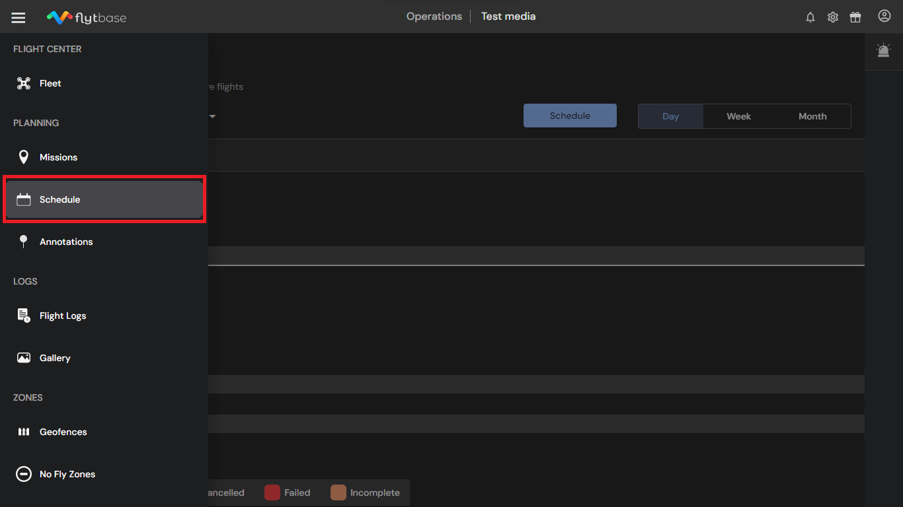
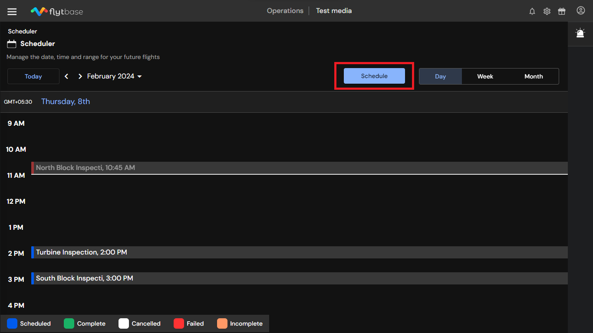
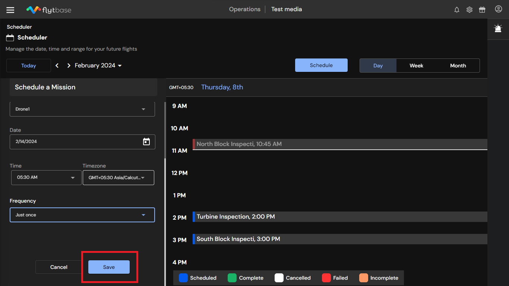
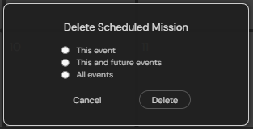

# Mission Scheduler

## Overview 

## Key Highlights

* FlytBase Scheduler interface organizes the drone fleet's flight agenda efficiently.
* View scheduled missions with status on the calendar.
* Mission card indicates reasons for failed or incomplete missions and links the flight logs for completed missions.
* Manage scheduled missions by editing, cancelling, duplicating, or deleting as needed.

Mission Scheduler automates routine drone flights for timely maintenance, progress tracking, perimeter monitoring, asset inspections and data collection.

## Overview 

FlytBase features a Scheduler window that displays the pre-planned flight schedule of the drone fleet. Operators can easily plan their missions through the **days, weeks and months** tabs.

.png>)

.png>)

.png>)

### Scheduling a Mission 

To schedule a mission, navigate to the Planning section in the dashboard and select **Schedule**.

This will redirect you to the Mission Scheduler Page.

Next, click on the **Schedule** button to plan a mission.

The scheduler menu will open on the left side of the screen.

.png>)

Fill in schedule details, such as drone, mission, mission frequency (repetitive or one-time), date, time, and timezone. Click **Save** to schedule the mission.

The scheduled mission will be visible on your calendar with its status.

#### Mission Status 

Missions in the dashboard are classified based on their scheduling status:

* **Scheduled (**<mark style="color:blue;">**Blue**</mark>**):** All missions that have been scheduled in the system are assigned the **Scheduled** status. These missions will be executed at the set time.
* **Complete (**<mark style="color:green;">**Green**</mark>**):** Once a mission is completed, it is assigned the **Complete** status.
* **Cancelled (**<mark style="color:orange;">**Orange**</mark>**):** If a mission is cancelled at any point, it is assigned the **Canceled** status.
* **Missed (**<mark style="color:red;">**Red**</mark>**):** Missions scheduled but not executed as planned are assigned the **Missed** status.

The scheduler pop-up shows the name of the mission, the date scheduled, the name of the drone and the reason for your failed mission.

<figure><figcaption>
Completed Mission
</figcaption></figure>

<figure><figcaption>
Incomplete Mission
</figcaption></figure>

<figure><figcaption>
Failed Mission
</figcaption></figure>

.png>)


* Scheduled missions will be executed automatically at the set time.
* Toaster messages on the dashboard will notify you 5 minutes before the scheduled time of the mission.


### Managing Scheduled Missions 

#### Duplicate Mission:

The duplicate mission feature allows you to duplicate an existing mission and make changes to its time, date and name. You can also change its frequency.

<figure><figcaption>
Duplicate Mission
</figcaption></figure>

This option can be selected by clicking on the three dots on the top right side of the pop-up and then clicking on a duplicate mission.

### Managing Scheduled Missions 

Users can easily edit, cancel, and delete a scheduled mission when required. In the calendar view, select a mission.

.png>)

Utilize the Mission Scheduler to efficiently conduct repeatable autonomous missions with minimal human intervention.

To plan a mission, refer to the [link.](mission-planning/)&#x20;

Refer to the following documentation to learn more about how to set up your [first flight using FlytBase](../../in-flight-modules/setting-up-your-first-flight.md).
