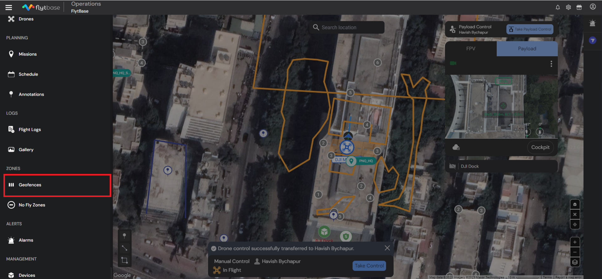

# Zones

With Zones, you gain the power to tailor your drone's operational space. This feature enables you to create and manage No Fly Zones and Geofences right from your dashboard. It's designed to ensure your drones fly exactly where you want them to, enhancing safety and compliance with regulations.

## Types of Zones: FlytBase supports two primary types of Zones:

* Geofence: These are customizable virtual geographical boundaries for the drone. Users can view, manage, create, or import custom geofences as per their specific requirements. Once the Geofence has been added, users can link it with a specific Dock to use it with the respective device.
* No Fly Zone: These are predefined areas where flying is restricted or prohibited, ensuring compliance with local regulations and safety protocols. Users can create, import, and manage NFZs. These apply to all the devices added within an Organization once synchronized accordingly.



### Accessing the Geofence Section:

* Navigate to the' Geofence' section to view, manage, create, or import custom Geofences for your organization.

<figure><figcaption>
Geofence Section
</figcaption></figure>

* Now, left-click on the "+" button to add a new Geofence. There are two ways to add one:&#x20;
  * Create
  * Import

### Creating a Geofence

<figure><figcaption>
Add a Geofence
</figcaption></figure>

* To create a **Polygon Geofence**, select 'Polygon' and left-click on the map. Then adjust the vertices according to your airspace environment and click on 'create'.

<figure><figcaption>
Creating a 'Polygon' GeoFence
</figcaption></figure>

* To create a **Circular Geofence**, click on 'Circular', then left-click on the map. Adjust the circle's radius by either dragging the node points or directly setting the radius.

<figure><figcaption>
Creating a 'Circular' GeoFence
</figcaption></figure>

* Operators can toggle the Geofences to be Active/Inactive on the Geofence page.

<figure><figcaption>
Toggle Geofence Active/Inactive
</figcaption></figure>

The Drone will create a smart path within the Geofence in the following scenarios:

1. Go-to Location is executed: In case a Geofence is active, and a Go-to location is initiated, the drone will create a smart path to reach the intended point and stay within the Geofence area.
2. RTDS is initiated: In a scenario where a Geofence is present and active, and RTDS is initiated, the drone will create a smart path to reach the docking station and stay within the Geofence area.


You can add an NFZ inside a Geofence.


### Assign a Geofence to the device

* To assign a Geofence to a device, navigate to the 'Zones' section on the device page.

<figure><figcaption>
Select a Geofence for the device.
</figcaption></figure>

* Click on 'Select from Library' to choose a geofence for the specific device.

<figure><figcaption>
Geofence List
</figcaption></figure>


Geofences that are compatible with the device can be selected.


* Once selected, click on 'Sync' to apply the changes and synchronize the particular device with the Geofence and NFZs.

Expected Behavior of the Drone when Geofence is Active:

| Scenario                        | Description                                                                           | Behaviour                                                                                                                                         |
| ------------------------------- | ------------------------------------------------------------------------------------- | ------------------------------------------------------------------------------------------------------------------------------------------------- |
| Mission Outside Geofence        | The drone is on a mission that leads it outside the boundaries of an active Geofence. | The drone initiates a Return-to-Home (RTH) procedure upon approaching the Geofence.                                                               |
| Go-To Location Outside Geofence | 'Go-To' location command is issued, directing the drone outside the Geofence.         | The drone initially accepts the command and begins the flight. However, it will abort the 'Go-To' maneuver upon Geofence approach and will hover. |
| Dock Outside Geofence           | The docking station is located outside the Geofence, and a mission is assigned.       | The drone will not take off, recognizing the dock's location is outside the Geofence.                                                             |


Ensure that the Geofence boundaries are always at a minimum of 20m away from the Dock location and the intended flying areas.




### Accessing the No Fly Zones Section:

* Navigate to the 'NFZ' section to view, manage, create, or import custom NFZs for your organization.

<figure><figcaption>
NFZ Section
</figcaption></figure>

* Now, left-click on the "+" button to add a new Geofence. There are two ways to add one:&#x20;
  * Create
  * Import

### Creating an NFZ

<figure><figcaption>
Add a NFZ
</figcaption></figure>

* To create a **Polygon NFZ**, select 'Polygon' and left-click on the map. Then adjust the vertices according to your airspace environment and click on 'create'.

<figure><figcaption>
Creating a 'Polygon' NFZ
</figcaption></figure>

* To create a **Circular NFZ**, click on 'Circular', then left-click on the map. Adjust the circle's radius by either dragging the node points or directly setting the radius.

<figure><figcaption>
Creating a 'Circular' NFZ
</figcaption></figure>


NFZs are universal for all devices registered within an organization, unlike Geofences, which are specific to individual devices.


### Syncing NFZ across all devices

*   Easily sync an NFZ across all the devices within an organization. Following are the different methods you can perform this operation:

    * &#x20;Inside the 'NFZ' tab within the Navigation drawer, you can easily sync the NFZ with all the devices.&#x20;

    <figure><figcaption>
Syncing NFZs across all devices
</figcaption></figure>

    * Once, synced you will receive a confirmation notification that syncing has started.


The Drone will create a smart path avoiding the NFZ only in the following scenarios:

1. Go-to Location is executed: In case an NFZ is active and present between the drone and the intended Go-to location point, the drone will avoid the NFZs and fly towards the location.
2. RTDS is initiated: In a scenario where an NFZ is present and active between the drone and the Dock location, the drone will avoid the NFZs and fly towards the Docking Station.


#### Expected Behavior of the Drone while the NFZ is active:

| Scenario                                 | Description                                                                                            | Expected Behavior                                                                                                                                        |
| ---------------------------------------- | ------------------------------------------------------------------------------------------------------ | -------------------------------------------------------------------------------------------------------------------------------------------------------- |
| Mission Through NFZ                      | Mission path goes through an NFZ with both NFZ and Geofence synchronized (NFZ is inside the Geofence). | On approaching the NFZ, the drone initiates Return-to-Docking-Station.                                                                                   |
| Active NFZ that covers the Dock location | An active NFZ covers the Dock location, and a mission is launched.                                     | The enclosure opens, but the drone cannot perform a take off due to the NFZ restriction. The enclosure simply closes and the Dock is back to idle state. |


Ensure that the NFZ boundaries are always at a minimum of 20m away from the Dock location and the intended flying areas.




### Flight Configuration:

#### Setting the Maximum Flight Altitude and Distance Limit:&#x20;

* To set the Max Flight Altitude Limit for a device, navigate to the 'Zones' section on the devices page.
* Enter the Altitude value between 20m-1500m.
* Similarly, enter a Maximum Distance Limit value between 15m-8000m.


- Upon achieving the Altitude Limit, the drone will continue the ongoing action without breaching the altitude limit or abort the launch.
- In case the Distance Limit is breached, the drone will stop its ongoing action and hover, or abort the launch.


<figure><figcaption>
Flight Configuration
</figcaption></figure>
